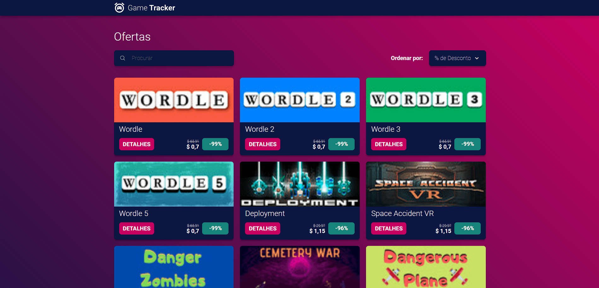

# ECBR Frontend Challenge

Check it out here: [https://ecbr-teste-front-end.vercel.app](https://ecbr-teste-front-end.vercel.app)

## 📋 Presentation

This project was created in April 2023 to fulfill the frontend challenge set by the company "E-Commerce Brasil" as part of their selection process for a Front-end Developer position. It consists of a gaming website featuring a product grid with filters and a search field, based on a design made with Figma.

## 🛠️ Technologies Used
- JavaScript
- React.js
- HTML5
- CSS3
- Styled-components
- ESLint
- Prettier

## 📫 Contact

